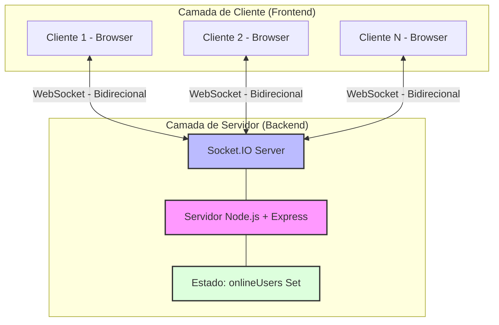
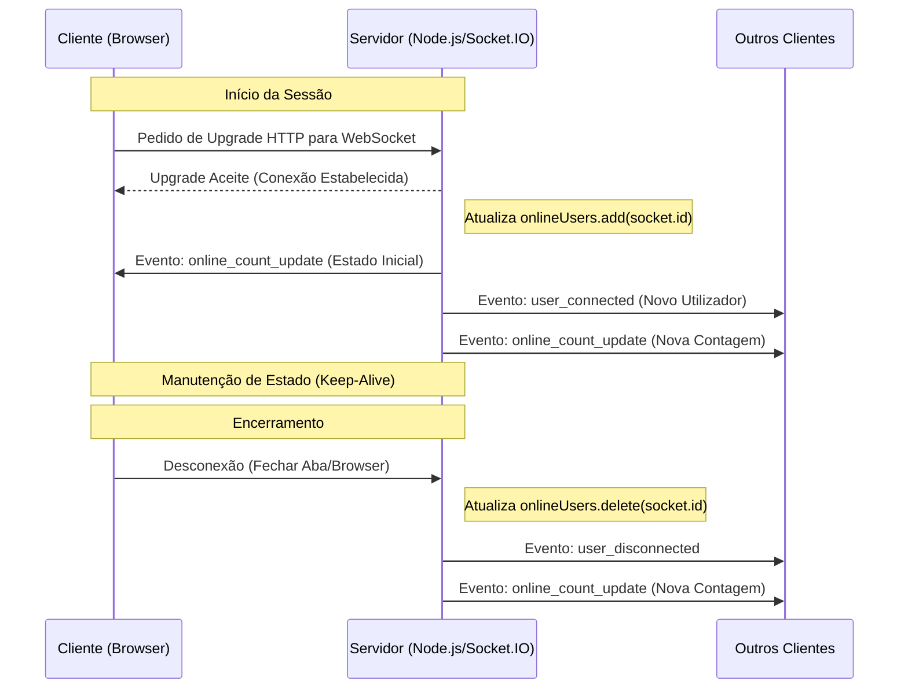

# Sistema Web de Monitorização em Tempo Real de Utilizadores Online

## Visão Geral

Este projeto didático implementa um sistema web capaz de exibir, em tempo real, a quantidade de utilizadores logados/conectados simultaneamente. A atualização dinâmica é realizada utilizando a tecnologia WebSocket, demonstrando conceitos fundamentais de Sistemas Distribuídos.

## Objetivos do Trabalho

O principal objetivo deste sistema é ilustrar e aplicar os seguintes conceitos de Sistemas Distribuídos:

*   **Comunicação em tempo real**: Através de WebSockets, o sistema mantém uma conexão persistente entre cliente e servidor para trocas de dados instantâneas.
*   **Comunicação cliente-servidor**: Demonstra a interação entre um frontend web (cliente) e um backend Node.js (servidor).
*   **Concorrência de múltiplos clientes**: O servidor é capaz de gerir e responder a múltiplas conexões de clientes simultaneamente.
*   **Atualização distribuída de estado**: O estado do número de utilizadores online é mantido no servidor e distribuído para todos os clientes conectados.
*   **Escalabilidade básica**: A arquitetura permite uma expansão futura para lidar com um número crescente de utilizadores e instâncias de servidor.
*   **Sincronização entre múltiplos clientes conectados**: Todos os clientes recebem as mesmas atualizações de contagem de utilizadores em tempo real, garantindo uma visão consistente do estado do sistema.

## Conceitos de Sistemas Distribuídos Aplicados

### Comunicação Síncrona vs Assíncrona

*   **Comunicação Síncrona**: Numa comunicação síncrona, o remetente espera por uma resposta antes de continuar a sua execução. Exemplos incluem chamadas de API REST tradicionais, onde o cliente envia um pedido e aguarda a resposta do servidor. Este modelo pode levar a bloqueios e menor eficiência em cenários de alta concorrência.
*   **Comunicação Assíncrona**: Na comunicação assíncrona, o remetente envia uma mensagem e continua a sua execução sem esperar por uma resposta imediata. A resposta, quando chega, é tratada por um mecanismo de *callback* ou evento. WebSockets são um excelente exemplo de comunicação assíncrona, permitindo que tanto o cliente quanto o servidor enviem dados a qualquer momento, sem bloquear a outra parte. Isso é crucial para aplicações em tempo real, onde a baixa latência e a alta capacidade de resposta são essenciais.

### WebSocket

WebSocket é um protocolo de comunicação que fornece canais de comunicação *full-duplex* (bidirecionais) sobre uma única conexão TCP. Ao contrário do HTTP, que é *half-duplex* e baseado em um modelo de pedido/resposta, o WebSocket permite que o servidor envie dados para o cliente a qualquer momento, e vice-versa, após o estabelecimento da conexão. Isso elimina a necessidade de *polling* constante (onde o cliente periodicamente pede atualizações ao servidor), reduzindo a latência e o tráfego de rede, tornando-o ideal para aplicações em tempo real como chats, jogos online e, como neste projeto, monitores de estado em tempo real.

### Estado Distribuído

Em sistemas distribuídos, o **estado** refere-se aos dados e informações que descrevem a condição atual do sistema. Um **estado distribuído** significa que esses dados não residem num único local, mas são replicados ou partilhados entre múltiplos nós ou componentes do sistema. Neste projeto, o número de utilizadores online é um exemplo de estado distribuído. Embora a contagem principal seja mantida no servidor Node.js, essa informação é constantemente partilhada e sincronizada com todos os clientes conectados, que por sua vez exibem esse estado de forma consistente. O desafio é garantir a consistência e a atualização em tempo real desse estado em todos os pontos do sistema.

### Concorrência

**Concorrência** refere-se à capacidade de um sistema de lidar com múltiplas tarefas ou processos que progridem independentemente, aparentemente ao mesmo tempo. Num sistema distribuído, isso significa que vários clientes podem interagir com o servidor simultaneamente. O servidor deve ser projetado para gerir essas interações concorrentes de forma eficiente, garantindo que as operações (como adicionar ou remover um utilizador) sejam processadas corretamente e que o estado do sistema seja atualizado de forma atómica e consistente, evitando condições de corrida e inconsistências de dados. O `Socket.IO` e o `Node.js` são particularmente adequados para lidar com concorrência devido ao seu modelo de E/S não bloqueante e baseado em eventos.

### Escalabilidade

**Escalabilidade** é a capacidade de um sistema de lidar com um volume crescente de trabalho ou de se adaptar a um aumento na demanda. Existem dois tipos principais:

*   **Escalabilidade Vertical (Scale Up)**: Aumentar os recursos de um único servidor (CPU, RAM, disco).
*   **Escalabilidade Horizontal (Scale Out)**: Adicionar mais servidores ou nós ao sistema para distribuir a carga. Este é o método preferido em sistemas distribuídos.

Este projeto, embora simples, é construído com uma arquitetura que favorece a escalabilidade horizontal, especialmente se considerarmos a adição de um mecanismo como Redis Pub/Sub para sincronizar múltiplas instâncias do servidor, conforme sugerido nas melhorias futuras.

### Tolerância a Falhas Básica

**Tolerância a falhas** é a capacidade de um sistema continuar a operar corretamente mesmo na presença de falhas em um ou mais dos seus componentes. Num sistema distribuído, as falhas podem ocorrer em redes, servidores ou clientes. Este projeto demonstra uma tolerância a falhas básica ao lidar com a desconexão de clientes: o sistema deteta automaticamente quando um cliente sai e atualiza a contagem global sem interromper o serviço para os restantes. Para uma tolerância a falhas mais robusta em cenários de produção, seriam necessários mecanismos como replicação de dados, *failover* automático e balanceamento de carga.

### Comunicação Orientada a Eventos

Na **comunicação orientada a eventos**, os componentes do sistema interagem através do envio e receção de eventos. Um evento é uma notificação de que algo significativo aconteceu. Em vez de chamar funções diretamente, os componentes *emitem* eventos e outros componentes *ouvem* esses eventos e reagem a eles. O `Socket.IO` é um exemplo paradigmático de comunicação orientada a eventos, onde o servidor emite eventos como `user_connected` ou `online_count_update`, e os clientes ouvem e reagem a esses eventos para atualizar a sua interface. Este modelo desacopla os componentes, tornando o sistema mais flexível e escalável.

### Broadcast em Sistemas Distribuídos

**Broadcast** é um padrão de comunicação onde uma mensagem é enviada de um remetente para todos os recetores disponíveis numa rede ou grupo. Em sistemas distribuídos, o *broadcast* é essencial para manter a consistência do estado em tempo real entre múltiplos clientes. Neste projeto, quando um utilizador se conecta ou desconecta, o servidor utiliza o mecanismo de *broadcast* do `Socket.IO` (`io.emit()`) para enviar a atualização da contagem de utilizadores online para *todos* os clientes conectados. Isso garante que todos os utilizadores vejam a mesma informação atualizada simultaneamente.

## Arquitetura do Sistema

O sistema segue uma arquitetura **cliente-servidor** com comunicação bidirecional em tempo real, conforme ilustrado no diagrama abaixo.

### Diagrama de Arquitetura



**Explicação da Arquitetura:**

*   **Camada de Cliente (Frontend)**: Composta por múltiplos navegadores web (Clientes 1 a N) que executam a aplicação frontend (HTML, CSS, JavaScript). Cada cliente estabelece uma conexão WebSocket individual com o servidor.
*   **Camada de Servidor (Backend)**: Consiste num servidor Node.js que utiliza o framework Express para gerir rotas HTTP básicas (embora neste projeto seja principalmente para servir ficheiros estáticos e uma rota de saúde) e o `Socket.IO` para gerir as conexões WebSocket.
*   **Socket.IO Server**: É o coração da comunicação em tempo real. Ele lida com o estabelecimento e a manutenção das conexões WebSocket, bem como com o envio e receção de mensagens.
*   **Estado (`onlineUsers` Set)**: Uma estrutura de dados em memória no servidor que armazena os IDs únicos de todos os clientes atualmente conectados. Este é o 
representante do estado distribuído neste projeto.

### Fluxo de Comunicação Cliente-Servidor

O fluxo de comunicação entre o cliente e o servidor é essencialmente bidirecional e orientado a eventos, conforme detalhado no fluxograma abaixo.



**Explicação do Fluxo:**

1.  **Conexão Inicial**: O cliente (navegador) faz um pedido HTTP ao servidor. O servidor responde com um `Upgrade` para o protocolo WebSocket.
2.  **Estabelecimento da Conexão**: Uma vez que o upgrade é aceite, uma conexão WebSocket *full-duplex* é estabelecida entre o cliente e o servidor.
3.  **Registo de Utilizador**: No servidor, o `socket.id` do novo cliente é adicionado ao conjunto `onlineUsers`.
4.  **Broadcast de Conexão**: O servidor emite um evento `user_connected` para *todos* os clientes (incluindo o recém-conectado) e um evento `online_count_update` com a nova contagem total de utilizadores online. Isso garante que todos os clientes tenham uma visão consistente do número de utilizadores.
5.  **Desconexão**: Quando um cliente fecha a aba do navegador ou perde a conexão, o evento `disconnect` é acionado no servidor.
6.  **Atualização de Desconexão**: O `socket.id` do cliente desconectado é removido de `onlineUsers`. O servidor então emite eventos `user_disconnected` e `online_count_update` para todos os clientes restantes, informando sobre a mudança na contagem.

## Tecnologias Utilizadas

### Backend

*   **Node.js**: Ambiente de execução JavaScript assíncrono e orientado a eventos, ideal para aplicações em tempo real.
*   **Express**: Framework web minimalista e flexível para Node.js, utilizado para configurar o servidor HTTP e servir ficheiros estáticos.
*   **Socket.IO**: Biblioteca para comunicação bidirecional em tempo real baseada em eventos. Abstrai a complexidade dos WebSockets e oferece *fallbacks* para navegadores mais antigos.

### Frontend

*   **HTML5**: Linguagem de marcação para estruturar o conteúdo da página web.
*   **CSS3**: Linguagem de folhas de estilo para estilizar a interface do utilizador.
*   **JavaScript Puro**: Linguagem de programação para a lógica interativa do lado do cliente, incluindo a conexão e manipulação do WebSocket e a atualização do gráfico.
*   **Chart.js**: Biblioteca JavaScript de código aberto para visualização de dados, utilizada para criar o gráfico de linha em tempo real.

## Estrutura do Projeto

O projeto está organizado na seguinte estrutura de diretórios:

```
distributed-systems-project/
├── server/
│   ├── server.js
│   └── package.json
│
├── client/
│   ├── index.html
│   ├── style.css
│   └── script.js
│
└── README.md
└── architecture.mmd
└── architecture.png
└── sequence.mmd
└── sequence.png
```

*   `server/`: Contém os ficheiros do backend Node.js.
    *   `server.js`: Lógica principal do servidor Express e Socket.IO.
    *   `package.json`: Metadados do projeto e lista de dependências do backend.
*   `client/`: Contém os ficheiros do frontend web.
    *   `index.html`: Estrutura da página web.
    *   `style.css`: Estilos CSS para a interface.
    *   `script.js`: Lógica JavaScript do cliente, incluindo a conexão WebSocket e a manipulação do Chart.js.
*   `README.md`: Este ficheiro, contendo a documentação completa do projeto.
*   `architecture.mmd`: Ficheiro fonte do diagrama de arquitetura (Mermaid).
*   `architecture.png`: Imagem PNG do diagrama de arquitetura.
*   `sequence.mmd`: Ficheiro fonte do fluxograma de comunicação (Mermaid).
*   `sequence.png`: Imagem PNG do fluxograma de comunicação.

## Funcionalidades Técnicas

### Backend (`server.js`)

*   **Servidor HTTP**: Cria um servidor HTTP básico usando Express para servir o frontend e fornecer uma rota de saúde.
*   **Servidor WebSocket**: Inicia um servidor WebSocket com Socket.IO, escutando por novas conexões.
*   **Controlo de Utilizadores Conectados**: Mantém um conjunto (`onlineUsers`) em memória para rastrear os IDs de todos os clientes conectados.
*   **Eventos em Broadcast**: Envia eventos (`user_connected`, `user_disconnected`, `online_count_update`) para todos os clientes conectados sempre que há uma mudança no número de utilizadores online.
*   **Atualização da Contagem Global**: A contagem de utilizadores é atualizada em tempo real e transmitida para todos os clientes.

### Frontend (`index.html`, `style.css`, `script.js`)

*   **Conexão Automática ao WebSocket**: O `script.js` estabelece automaticamente uma conexão com o servidor WebSocket ao carregar a página.
*   **Receção de Atualizações em Tempo Real**: O cliente ouve os eventos emitidos pelo servidor (`online_count_update`, `user_connected`, `user_disconnected`) e reage a eles.
*   **Atualização Dinâmica do Gráfico**: O Chart.js é utilizado para exibir um gráfico de linha que mostra o número de utilizadores online ao longo do tempo, com novos pontos adicionados dinamicamente sem recarregar a página.
*   **Contador de Utilizadores Online**: Um elemento na interface exibe a contagem atual de utilizadores online.
*   **Histórico Simples de Conexões**: Um log de eventos mostra as ações de conexão e desconexão dos utilizadores.

### Sobre o Gráfico

O gráfico de linha em tempo real apresenta:

*   **Eixo X**: Tempo (timestamps).
*   **Eixo Y**: Número de utilizadores online.

O gráfico é atualizado dinamicamente, adicionando novos pontos à medida que a contagem de utilizadores muda e mantendo um histórico dos últimos `N` pontos para visualização.

## Tutorial de Execução

Siga os passos abaixo para configurar e executar o projeto:

1.  **Pré-requisitos**:
    *   Certifique-se de ter o [Node.js](https://nodejs.org/) e o [npm](https://www.npmjs.com/) (gerenciador de pacotes do Node.js) instalados na sua máquina.

2.  **Clonar o Repositório (ou criar os ficheiros manualmente)**:
    ```bash
    git clone <URL_DO_REPOSITORIO> # Se estiver num repositório Git
    cd distributed-systems-project
    ```
    Ou, se criou os ficheiros manualmente, navegue até a pasta `distributed-systems-project`.

3.  **Instalar Dependências do Backend**:
    Navegue até o diretório `server` e instale as dependências:
    ```bash
    cd server
    npm install
    ```
    Isso instalará `express` e `socket.io`.

4.  **Iniciar o Servidor Backend**:
    No diretório `server`, execute o servidor:
    ```bash
    npm start
    ```
    Você deverá ver uma mensagem no console indicando que o servidor está a correr na porta 3000 (ou outra porta configurada).

5.  **Aceder ao Frontend**:
    Abra o ficheiro `client/index.html` no seu navegador web. Alternativamente, se o servidor Express estiver a servir os ficheiros estáticos (como configurado neste projeto), pode aceder a `http://localhost:3000` no seu navegador.

6.  **Testar a Aplicação**:
    *   Abra várias abas ou janelas do navegador para simular múltiplos utilizadores.
    *   Observe o contador de 
utilizadores online e o gráfico a atualizar em tempo real em todas as abas/janelas.
    *   Feche algumas abas para ver a contagem a diminuir.

## Sugestões de Melhorias Futuras

Este projeto serve como uma base didática. Para expandir e aprimorar o sistema, as seguintes melhorias podem ser consideradas:

*   **Autenticação Simples por Nome**: Implementar um sistema onde os utilizadores possam inserir um nome ao conectar, permitindo identificá-los no log de eventos e, potencialmente, no gráfico.
*   **Múltiplas Salas/Canais**: Adicionar a funcionalidade de criar diferentes 
salas ou canais de chat, onde a contagem de utilizadores online seria específica para cada sala.
*   **Persistência em Banco de Dados**: Armazenar o histórico de contagens de utilizadores ou eventos de conexão/desconexão num banco de dados (e.g., MongoDB, PostgreSQL) para análise posterior ou para exibir dados históricos mais longos.
*   **Dashboard Moderno**: Melhorar a interface do utilizador com um dashboard mais interativo e visualmente apelativo, talvez utilizando um framework de UI mais robusto como React ou Vue.js.
*   **Suporte a Múltiplas Instâncias do Servidor**: Para uma escalabilidade horizontal real, implementar um mecanismo de sincronização entre múltiplas instâncias do servidor Node.js. O [Redis Pub/Sub](https://redis.io/topics/pubsub) é uma solução comum para este cenário, permitindo que as instâncias do Socket.IO se comuniquem e partilhem o estado dos utilizadores.

## Comentários no Código

O código-fonte (`server.js` e `script.js`) está amplamente comentado para facilitar a compreensão de cada secção e da lógica implementada, especialmente no que diz respeito à interação com WebSockets e à gestão do estado de utilizadores.

--- 

**Autor:** Manus AI
**Nível do Projeto:** Académico Universitário
