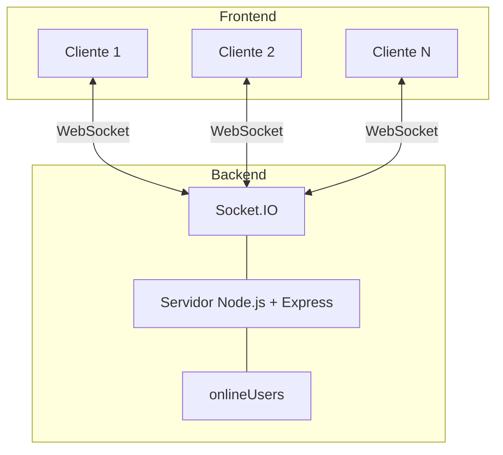
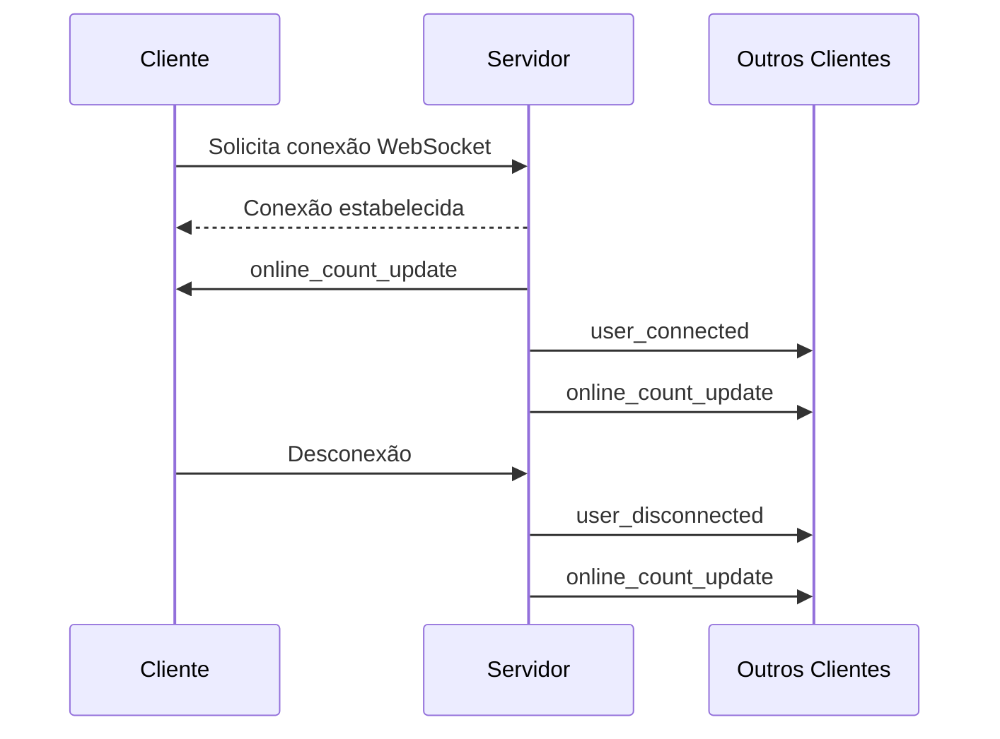

# Sistema Web de Monitoramento em Tempo Real de Usuários Online

## Visão Geral

Este projeto consiste no desenvolvimento de uma aplicação web capaz de monitorar e exibir, em tempo real, a quantidade de usuários conectados simultaneamente ao sistema. Para isso, foi utilizada a tecnologia WebSocket, que permite uma comunicação contínua entre cliente e servidor, tornando as atualizações instantâneas.

Além de demonstrar o funcionamento de uma aplicação em tempo real, o projeto busca aplicar diversos conceitos estudados na disciplina de Sistemas Distribuídos.

---

## Objetivos do Trabalho

O principal objetivo deste projeto é colocar em prática conceitos fundamentais de Sistemas Distribuídos, entre eles:

- Comunicação em tempo real utilizando WebSockets;
- Modelo de comunicação cliente-servidor;
- Gerenciamento de múltiplas conexões simultâneas;
- Compartilhamento e sincronização de estado entre diferentes clientes;
- Noções básicas de escalabilidade;
- Atualização consistente das informações para todos os usuários conectados.

Dessa forma, o sistema permite que todos os clientes visualizem a mesma quantidade de usuários online em tempo real, mantendo uma visão consistente do estado da aplicação.

---

## Conceitos de Sistemas Distribuídos Aplicados

### Comunicação Síncrona e Assíncrona

Na comunicação síncrona, o cliente precisa aguardar a resposta do servidor antes de continuar a execução. Um exemplo comum são as requisições HTTP tradicionais, nas quais uma solicitação é enviada e o processamento só continua após a resposta.

Já na comunicação assíncrona, o cliente não precisa esperar uma resposta imediata. As mensagens podem ser tratadas posteriormente por meio de eventos ou callbacks. Esse modelo é amplamente utilizado em aplicações que exigem atualizações em tempo real.

Neste projeto, os WebSockets utilizam comunicação assíncrona, permitindo que cliente e servidor troquem informações a qualquer momento sem bloquear a execução da aplicação.

### WebSocket

O WebSocket é um protocolo que possibilita comunicação bidirecional entre cliente e servidor através de uma única conexão TCP.

Diferentemente do HTTP tradicional, que segue o modelo requisição-resposta, o WebSocket mantém uma conexão aberta durante toda a sessão. Isso permite que o servidor envie informações ao cliente sempre que necessário, sem que o navegador precise solicitar novas atualizações constantemente.

Essa característica reduz a latência e o tráfego na rede, tornando o protocolo ideal para aplicações como chats, jogos online, notificações e monitoramento em tempo real.

### Estado Distribuído

Em sistemas distribuídos, o estado representa as informações que descrevem a situação atual da aplicação.

Neste projeto, o estado corresponde à quantidade de usuários conectados. Embora essa informação seja mantida pelo servidor, ela é compartilhada continuamente com todos os clientes conectados. Assim, todos os usuários visualizam os mesmos dados atualizados em tempo real.

Um dos desafios desse modelo é garantir que todas as partes do sistema permaneçam sincronizadas, evitando inconsistências entre as informações exibidas.

### Concorrência

A concorrência está relacionada à capacidade de um sistema lidar com várias operações acontecendo simultaneamente.

No contexto deste projeto, diversos usuários podem acessar a aplicação ao mesmo tempo. O servidor precisa processar todas essas conexões de forma eficiente, garantindo que a contagem de usuários online permaneça correta mesmo quando várias conexões e desconexões ocorrem simultaneamente.

O Node.js, juntamente com o Socket.IO, facilita esse processo por utilizar uma arquitetura orientada a eventos e operações de entrada e saída não bloqueantes.

### Escalabilidade

Escalabilidade é a capacidade de um sistema continuar funcionando adequadamente à medida que a quantidade de usuários aumenta.

Ela pode ocorrer de duas formas:

- **Escalabilidade Vertical (Scale Up):** aumento dos recursos de um único servidor, como memória e processamento;
- **Escalabilidade Horizontal (Scale Out):** adição de novos servidores para distribuir a carga de trabalho.

Embora este projeto tenha caráter didático, sua arquitetura permite futuras expansões para um ambiente distribuído mais robusto, utilizando mecanismos de sincronização entre múltiplas instâncias do servidor.

### Tolerância a Falhas

A tolerância a falhas representa a capacidade de um sistema continuar operando mesmo diante de problemas em alguns de seus componentes.

Neste projeto, existe uma forma simples de tolerância a falhas: quando um usuário perde a conexão ou fecha o navegador, o servidor detecta automaticamente a desconexão e atualiza a contagem de usuários online sem comprometer o funcionamento dos demais clientes conectados.

Em aplicações de produção, técnicas adicionais como replicação, balanceamento de carga e failover automático seriam necessárias para aumentar a confiabilidade do sistema.

### Comunicação Orientada a Eventos

A comunicação orientada a eventos é baseada na troca de mensagens chamadas eventos.

Nesse modelo, um componente emite um evento quando determinada ação ocorre, enquanto outros componentes ficam responsáveis por escutar e reagir a esses eventos.

O Socket.IO utiliza exatamente esse paradigma. Sempre que um usuário se conecta ou desconecta, eventos são disparados e recebidos pelos clientes, permitindo a atualização automática da interface.

Essa abordagem reduz o acoplamento entre os componentes e facilita a manutenção e expansão do sistema.

### Broadcast em Sistemas Distribuídos

Broadcast é uma técnica de comunicação na qual uma mensagem é enviada simultaneamente para todos os participantes conectados.

Neste projeto, sempre que ocorre uma alteração no número de usuários online, o servidor utiliza o método `io.emit()` para enviar a nova informação para todos os clientes conectados.

Dessa forma, todos os usuários recebem a atualização praticamente ao mesmo tempo, garantindo consistência nas informações exibidas.

---

## Arquitetura do Sistema

O sistema segue uma arquitetura cliente-servidor baseada em comunicação bidirecional em tempo real. Cada cliente estabelece uma conexão WebSocket com o servidor, permitindo o envio e recebimento de dados sem a necessidade de novas requisições HTTP.

### Diagrama de Arquitetura



### Funcionamento da Arquitetura

- Os clientes acessam a aplicação pelo navegador;
- O servidor Node.js gerencia as conexões;
- O Socket.IO mantém a comunicação em tempo real;
- O conjunto `onlineUsers` armazena os identificadores dos usuários conectados;
- Sempre que uma conexão é criada ou encerrada, todos os clientes recebem uma atualização da contagem.

---

## Fluxo de Comunicação Cliente-Servidor



### Descrição do Fluxo

1. O cliente solicita a conexão ao servidor.
2. Após a autenticação do WebSocket, a conexão é estabelecida.
3. O servidor registra o novo usuário conectado.
4. A contagem atualizada é enviada para todos os clientes.
5. Quando um usuário se desconecta, ele é removido da estrutura de controle.
6. O servidor envia novamente a nova contagem para todos os clientes conectados.

---

## Tecnologias Utilizadas

### Backend

- **Node.js:** ambiente de execução JavaScript voltado para aplicações escaláveis.
- **Express:** framework responsável pela criação do servidor HTTP.
- **Socket.IO:** biblioteca utilizada para comunicação em tempo real entre cliente e servidor.

### Frontend

- **HTML5:** estrutura da aplicação.
- **CSS3:** estilização da interface.
- **JavaScript:** lógica da aplicação no navegador.
- **Chart.js:** geração dos gráficos em tempo real.

---

## Estrutura do Projeto

```text
distributed-systems-project/
├── server/
│   ├── server.js
│   └── package.json
│
├── client/
│   ├── index.html
│   ├── style.css
│   └── script.js
│
├── README.md
├── architecture.mmd
├── architecture.png
├── sequence.mmd
└── sequence.png
```

### Organização dos Arquivos

#### Backend

- `server.js`: implementação do servidor e dos eventos Socket.IO.
- `package.json`: dependências e configurações do projeto.

#### Frontend

- `index.html`: estrutura da página.
- `style.css`: estilos visuais.
- `script.js`: lógica do cliente e comunicação com o servidor.

#### Documentação

- `README.md`: documentação do projeto.
- Arquivos `.mmd` e `.png`: diagramas da arquitetura e do fluxo de comunicação.

---

## Funcionalidades Técnicas

### Backend

- Inicialização do servidor HTTP;
- Gerenciamento das conexões WebSocket;
- Controle dos usuários online;
- Atualização automática da contagem de usuários;
- Envio de eventos para todos os clientes conectados.

### Frontend

- Conexão automática ao servidor;
- Atualização da interface em tempo real;
- Exibição da quantidade de usuários online;
- Registro de eventos de conexão e desconexão;
- Atualização dinâmica do gráfico sem recarregar a página.

### Gráfico em Tempo Real

O gráfico apresenta:

- **Eixo X:** tempo das atualizações;
- **Eixo Y:** quantidade de usuários online.

Os dados são atualizados automaticamente sempre que ocorre alguma alteração na quantidade de usuários conectados.

---

## Tutorial de Execução

### Pré-requisitos

É necessário possuir instalados:

- Node.js;
- npm.

### Instalação

Clone o projeto:

```bash
git clone <URL_DO_REPOSITORIO>
cd distributed-systems-project
```

Instale as dependências:

```bash
cd server
npm install
```

### Execução

Inicie o servidor:

```bash
npm start
```

Após a inicialização, acesse:

```text
http://localhost:3000
```

### Testes

Para verificar o funcionamento:

1. Abra a aplicação em múltiplas abas.
2. Observe a atualização do contador de usuários.
3. Feche algumas abas.
4. Verifique a atualização em tempo real para todos os clientes conectados.

---

## Possíveis Melhorias

Algumas evoluções que podem ser implementadas futuramente incluem:

- Autenticação de usuários por nome;
- Criação de salas independentes;
- Persistência de dados em banco de dados;
- Dashboard mais moderno utilizando React ou Vue;
- Integração com Redis Pub/Sub para sincronização entre múltiplas instâncias do servidor;
- Implementação de balanceamento de carga para cenários de maior escala.

---

## Considerações Finais

Este projeto permitiu aplicar conceitos importantes de Sistemas Distribuídos em um cenário prático, explorando comunicação em tempo real, gerenciamento de múltiplos clientes, sincronização de estado e arquitetura orientada a eventos.

Apesar de ser uma aplicação simples, a solução apresenta uma base sólida para evoluções futuras e demonstra como tecnologias como WebSocket e Socket.IO podem ser utilizadas para construir sistemas distribuídos capazes de fornecer atualizações instantâneas aos usuários.
